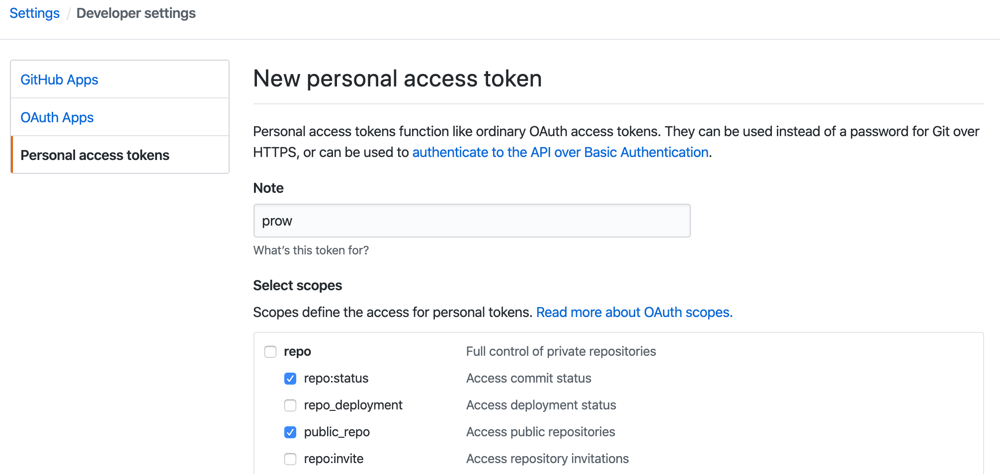
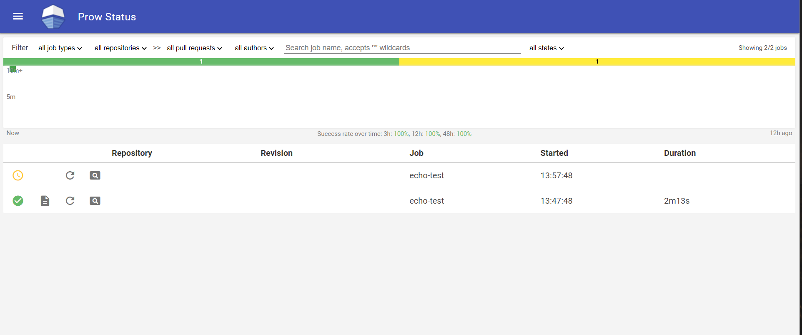
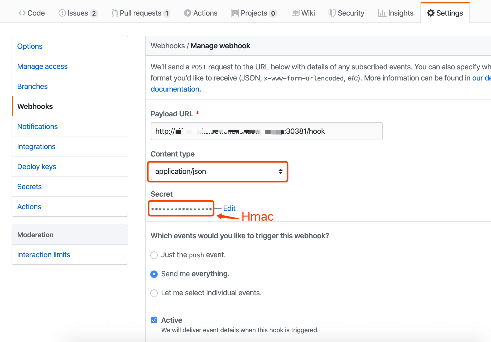

# 1.Prow 简介
Prow 是 Kubernetes 测试特别兴趣小组的项目，目前是 kubernetes/test-infra 的一部分。Prow 是一个基于 Kubernetes 使用各类事件驱动执行 Job 的 CI/CD 系统。

除了执行 Job ，Prow 还能通过以下方式，实现 GitHub 的自动化功能：

策略配置，权限控制等
/label 形式的 chat-ops 命令
自动合并 PR
使用 Prow ，我们可以将研发流程自动化，极大地提升了开发体验。

# 2. 部署
## 2.1 准备一个github账户
1. 准备一个github账户个人账户或者专门执行人物的机器人账户也行，将机器人账户添加为仓库管理员。
生成用于 Github 访问的 token

勾选 repo:status 和 public_repo 权限。

## 2.2 创建secret
1. 使用github token创建secret
```shell
kubectl create ns prow
echo "xxxTokenxxx" > oauth-token
kubectl -n prow create secret generic oauth-token --from-file=oauth=./oauth-token
```
2. 在集群生成 hmac ，用于 Github 的 Webhook 认证
```shell
openssl rand -hex 20 > hmac-token
kubectl -n prow create secret generic hmac-token --from-file=hmac=./hmac-token
```
3. 查看 hmac 值，将用于 Github 中 Webhook 的配置。
```shell
cat ./hmac-token

xxxHmacxxx
```
4. 部署prow
```shell
kubectl -n prow create -f mainfests/starter.yaml
```
5. 等待所有pod running,查看 svc,访问deck服务


# 3. 仓库配置
1. 给 Github 仓库添加 Webhook 配置

Payload URL 需要带上 /hook 路由。Content Type 需要选择 application/json 。Secret 是上面生成的 xxxHmacxxx 值。

2. 给 Github 仓库添加 OWNERS 文件

OWNERS 文件用于申明模块的 approvers 和 reviewers ，在 PR 流程中会用到。每个目录都可以使用 OWNERS 进行控制，这里在仓库根目录下添加该文件并提交。其中的 someone 用户，将可以通过评论 /lgtm ，合并 PR 。这里 Prow 中定义的规则是，同时存在 /lgtm 和 /approve 标签时，PR 将会被合并。但是存在一个特例，approver 可以省略 /approve 而直接使用 /lgtm 合并 PR，同时 approver 提交的 PR 会被加上 /approve 。
```shell
approvers:
    - someone

reviewers:
    - someone
```
3. 启用指定插件

创建插件描述文件 plugins.yaml ，这里以 wongearl/elk-stack 仓库为例。如果是多个仓库，可以按照 yaml 语法，列在 plugins 下。
```yaml
plugins:
  shaowenchen/prow-test:
  - size
  - lgtm
  - approve
  - label
  - trigger
  - hold
  - verify-owners
  - wip
  - milestone
  - welcome
  - heart
  - help
  - assign
```
执行命令：
```shell
kubectl -n prow create configmap plugins   --from-file=plugins.yaml=./manifests/plugins.yaml --dry-run=client -o yaml   | kubectl -n prow replace configmap plugins -f -
```
4. 配置 Tide

Tide 用于 PR 的合并，多个仓库可以按照 yaml 语法新增在 repos 字段下。prowjob_namespace 用于配置 deck、tide 等组件查询 prowjob 的 namespace。如果不是使用 default 进行部署，则需要进行配置。没有配置时，会出现 cannot list resource "prowjobs" in default namespace 的错误提示。
config.yaml
```yaml
prowjob_namespace: "prow"
tide:
  merge_method:
    kubeflow/community: squash

  target_url: http://ServiceIp:30855/tide
  queries:
  - repos:
    - shaowenchen/prow-test
    labels:
    - lgtm
    - approved
    missingLabels:
    - do-not-merge
    - do-not-merge/hold
    - do-not-merge/work-in-progress
    - needs-ok-to-test
    - needs-rebase

  context_options:
    from-branch-protection: true
    skip-unknown-contexts: true
    orgs:
      org:
        required-contexts:
        - "check-required-for-all-repos"
        repos:
          repo:
            required-contexts:
             - "check-required-for-all-branches"
            branches:
              branch:
                from-branch-protection: false
                required-contexts:
                - "required_test"
                optional-contexts:
                - "optional_test"
```
执行命令：
```shell
kubectl -n prow create configmap config --from-file=config.yaml=./manifests/config.yaml --dry-run=client -o yaml | kubectl -n prow replace configmap config -f -
```

5. 定制标签（可选）

通过 /xxx xxx 评论，能够给 issues 或 PR 添加标签。前提是仓库中已经新建了相关的二维标签。 如果需要定制标签，可以参考 内置标签 定义自己的 labels.yaml 。

```shell
kubectl -n prow create configmap label-config \
 --from-file=labels.yaml=labels.yaml --dry-run=client -o yaml \
 | kubectl -n prow replace configmap config -f -
```

6. checkconfig 工具

克隆 Prow 的代码仓库 kubernetes/test-infra/prow ，使用 Go 命令执行内置的命令。

```shell
git clone https://github.com/kubernetes/test-infra
cd test-infra
go run ./prow/cmd/checkconfig -plugin-config path/to/plugins.yaml -config-path path/to/config.yaml
```
# 4. 测试